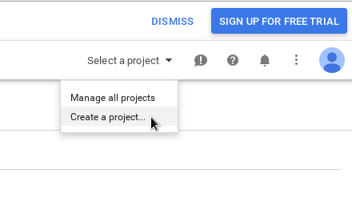
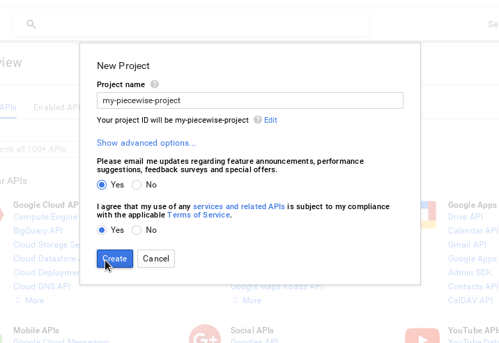
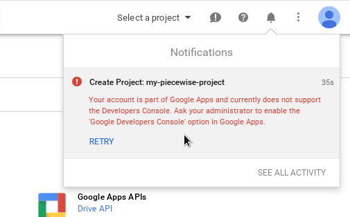
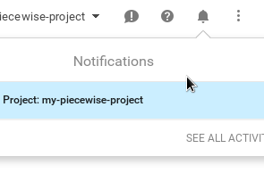
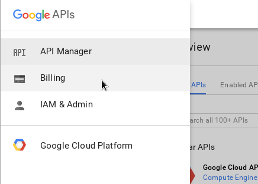
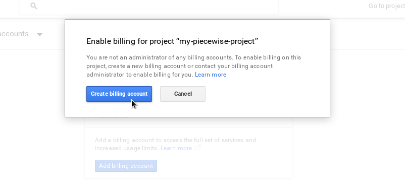
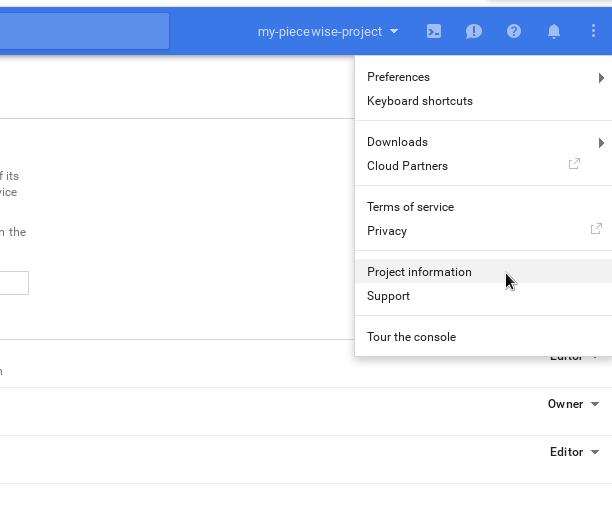
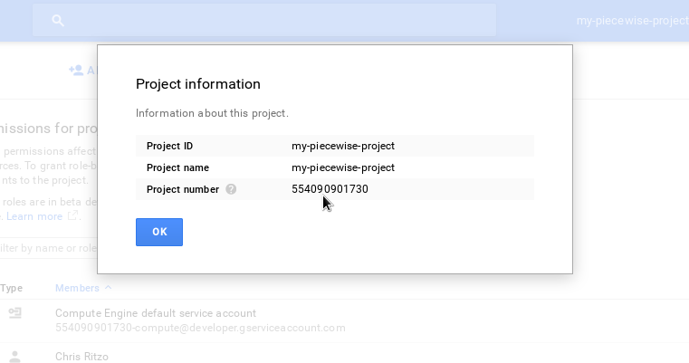

## Configuring and Deploying a Piecewise VM

We’re now ready to customize your copy of Piecewise for the region you care about. We recommend starting a text file to document information about your application that you’ll need to configure Piecewise, and that you might want to have on hand for your own documentation.

### Steps to configure and deploy Piecewise

  * Subscribe to M-Lab Discuss to whitelist a Google Developer account
  * Setup a project in Google Developer Console
  * Configure Piecewise for your location

**You will need the following information:**

  * Geographic coordinates forming a bounding box, for example: [-122.6733398438,47.3630134401,-121.9509887695,47.8076208172]
  * Shapefile(s) containing the sub-geographic areas by which the consumed raw data will be aggregated
  * Topojson or geojson file(s) created from your shapefile for the map front-end
  * A time range for which data should be consumed from M-Lab in format: Jan 1 2014 00:00:00
  * A Google account
  * A [MapBox](https://www.mapbox.com/) account if you intend to use MapBox base maps

### Subscribe to M-Lab Discuss to Whitelist a Google Account to use with your Piecewise instance

Piecewise requires a Google Account to be configured for ingesting M-Lab data from BigQuery. We recommend creating a separate account to use specifically for this purpose, rather than a personal account.

1. Create/Identify a Google account to use for your instance of Piecewise.

2. Subscribe that account to the [M-Lab Discuss Group](https://groups.google.com/a/measurementlab.net/forum/#!forum/discuss)

Once subscribed to M-Lab Discuss, **your account will be whitelisted to query the M-Lab dataset at no charge**.

### Configure an API project in the Google Developers console

Go to [Google Developers console](https://console.developers.google.com/project) and log in using the account that was whitelisted by M-Lab.

Create a Google-API project (or choose an already existing project) and turn on permissions for the BigQuery API.





If you are using an account maintained by an organization, use of Google Apps APIs may need to be enabled by the organization's Google Apps domain administrator. If this is the case, you may see notification errors to this effect.



If the project was created successfully, a notification should appear like the one below.



Turn on billing for the project in Google console (you will not be billed because your account is whitelisted, but Big Query requires API applications to have billing enabled)




Lastly, view your Project's Information details and make note the Project ID number. You'll use it later to configure your instance of Piecewise.




### Configure Piecewise for your location

The purpose of the Piecewise server is to consume M-Lab data from a particular geographic region and to aggregate it by sub-regions within that area. In its current state, configuring a new Piecewise server for a new region will require you to gather some information, modify a few files, and then run the Piecewise ingest and aggregate scripts.

#### Customize the location specific configuration folder and files

When you first clone the Piecewise code, it is customized for its original use in the Seattle Broadband Map. To use Piecewise for a new location, we will:

  * Rename key folders and files
  * Obtain and save geodata for your desired location
  * Update the contents of several configuration files with information about your Piecewise instance

In this example, we'll configure Piecewise for the city of Baltimore, Maryland, to aggregate M-Lab data by US Census Blocks.

**Please note that all commands below assume you are using linux or MacOS command line from inside the main ```piecewise``` folder cloned from Github.**


##### Rename key folders and files

Rename the **seattle_example** folder and two configuration files inside it: 

```
mv seattle_example baltimore_example
mv baltimore_example/seattle_tasks.yml baltimore_example/baltimore_tasks.yml
mv baltimore_example/seattle_center.py baltimore_example/baltimore_center.py
```

Remove Seattle specific files:

```
rm -rf  baltimore_example/seattle_*
```

##### Obtain and save geodata for your desired location

Next, we need to gather some information to configure your Piecewise server:

  * Geographic bounding box coordinates from which raw data will be consumed
  * The latitude and longitude coordinates for the center of your map
  * A shapefile containing the regions by which raw data will be aggregated by piecewise
  * A topojson file **created from the shapefile**, to be used by the map visualization

**Select a geographic bounding box**

First, we need to tell Piecewise the geographic area for which it should ingest M-Lab data. This will be in the form of four coordinates. There are many tools to help define a bounding box. We used [http://boundingbox.klokantech.com/](http://boundingbox.klokantech.com/). 

Search for "Baltimore, MD" on [http://boundingbox.klokantech.com/](http://boundingbox.klokantech.com/) and then change the settings in the lower left menu to **CSV**

Copy the coordinates at the bottom of the page to use as the coordinates of your bounding box. They should like this: ```-76.711519,39.197207,-76.529453,39.372206```

**Open the file ```baltimore_example/piecewise_config.json```**. Near the end of this file, replace the bounding box coordinates with your coordinates on this line: ```{ "type": "bbox", "bbox": [-76.711519,39.197207,-76.529453,39.372206] },``` with the bounding box coordinates you copied above.

Save your changes. You will make additional changes to this file later. 

**Find the coordinates for the center of your map**

Piecewise needs to know the coordinates for the center of your map. Again, there are many ways to find this information. We searched [Google Maps](https://www.google.com/maps) for Baltimore, MD, which shows us [a map with Baltimore at the center](https://www.google.com/maps/place/Baltimore,+MD/@39.2848182,-76.6906973,12z/data=!3m1!4b1!4m2!3m1!1s0x89c803aed6f483b7:0x44896a84223e758).

Find the latitude and longitude coordinates for your desired location.

We obtained the latitude and longitude coordinates by copying them from the URL:

```
https://www.google.com/maps/place/Baltimore,+MD/@39.2848182,-76.6906973,12z/
data=!3m1!4b1!4m2!3m1!1s0x89c803aed6f483b7:0x44896a84223e758
```

The map center is the two coordinates after the @ sign in the URL: ```39.2848182,-76.6906973```

Open the file ```baltimore_example/center.js```, and replace the latitude and longitude coordinates between the brackets on this line: ```var center = [39.2847064,-76.620486];``` with your map center coordinates.

**Obtain shapefiles for your data aggregation areas**

Piecewise will download raw test data from M-Lab that was submitted from within the four coordinates you gathered in the previous step. Its real power, however, is that Piecewise will aggregate the raw data into smaller shaped areas within that bounding box. You can define multiple aggregations and use them as different layers in the same map or visualization. For example, we might use city council districts, counties, countries, census blocks or other shapes to aggregate M-Lab data.

To do these aggregations, Piecewise requires at least one geodata file containing the areas you wish M-Lab data to be aggregated into. This example uses shapefiles but your geodata can be in any of the following formats: 

  * Shapefile (.shp)
  * Geojson
  * Topojson

The US Census Bureau provides downloadable shapefiles for a variety of boundaries in the US: [https://www.census.gov/geo/maps-data/data/cbf/cbf_blkgrp.html](https://www.census.gov/geo/maps-data/data/cbf/cbf_blkgrp.html). In the US, cities often publish shapefiles for their communities that often have been amended or corrected.

Once you locate the shapefile(s) you need, it's good practice to open the shapefile in [QGIS](http://www.qgis.org/en/site/) or another program to confirm it's ok.

**Create a folder for your geodata file(s)**

```mkdir baltimore_example/maryland_blkgrps```

Save/copy your shapefiles to the folder.

**Create a topojson file from your shapefile**

The shapefile(s) above will be used by Piecewise to aggregate raw M-Lab data, but you also want to use a map or other visualization to display your data.

The map visualization that Piecewise provides by default requires a **topojson file that is created from the same shapefile** you downloaded in the previous section.

Here are some resources for creating or converting geofiles:

  * [QGIS](http://www.qgis.org/en/site/)
  * [Mapshaper](http://mapshaper.org/)
  * [Topojson / geojson converter](http://jeffpaine.github.io/geojson-topojson/)

Save your topojson file to the **baltimore_example** folder. In our example, this file is named **maryland_blkgrps_2015.json**

When you're done, the **baltimore_example** folder should contain the files below:

```
baltimore_center.py
baltimore_tasks.yml
center.js
extra_data.py
maryland_blkgrps/
  	cb_2015_24_bg_500k.cpg  	cb_2015_24_bg_500k.shp.ea.iso.xml
    cb_2015_24_bg_500k.dbf  	cb_2015_24_bg_500k.shp.iso.xml
    cb_2015_24_bg_500k.prj  	cb_2015_24_bg_500k.shp.xml
    cb_2015_24_bg_500k.shp  	cb_2an015_24_bg_500k.shx
maryland_blkgrps_2015.json
piecewise_config.json
README.md
```

##### Update Piecewise configuration files with your values

Now we have all the information we need to configure your Piecewise server. This will involve updating the values in several files in your configuration folder.

###### Edit the primary Ansible playbook

The main Ansible playbook YAML file, ```piecewise/playbook.yml```, must be edited to include our new Baltimore example Ansible playbook. Lines in this file that begin with a **#** sign are code comments that highlight the modifications you need to make to the lines below the comment.

```
---
# This is main Ansible playbook that configures your Piecewise server. You don't 
# need to be an Ansible expert to use Piecewise. Follow the instructions in the 
# code comments below to configure Piecewise for your desired location.
#
# For more information about Ansible and the syntax of this file, please see:
# http://docs.ansible.com/ansible/YAMLSyntax.html
#
# ------------------------------------------------------------------
# 
# 1) Rename the folder "seattle_example" to match your folder name, and 
#    the file "seattle_tasks.yml" to match the file name in your folder.
#
#    For example, change:
#       include: seattle_example/seattle_tasks.yml
#    to:
#       include: baltimore_example/baltimore_tasks.yml

- hosts: all
  tasks:
  - include: system_tasks.yml
    sudo: True
  - include: user_tasks.yml
  - include: seattle_example/seattle_tasks.yml
    sudo: True
```

###### Edit the system tasks Ansible playbook

The Ansible playbook, ```piecewise/system_tasks.yml```, installs and configures the software needed to run Piecewise. For most customizations of Piecewise, only a small change is needed to tell Ansible where your customized code is hosted. 

Open ```piecewise/system_tasks.yml``` and look for the section below:

```
# The command below tells Ansible where to download or copy your customized Piecewise files
# when it deploys your VM. Change the **repo** to match your fork and **version** to match 
# your branch.
#
#    For example, change:
#       git: repo=https://github.com/opentechinstitute/piecewise.git
#       dest=/opt/piecewise.git/
#       version=master
#    to:
#       git: repo=https://github.com/baltimore-github-org/piecewise.git
#       dest=/opt/piecewise.git/
#       version=master
#
# Note that the example above is fictious. Use the github URL of your fork and your branch. 

- name: Fetch piecewise
  git: repo=https://github.com/opentechinstitute/piecewise.git
       dest=/opt/piecewise.git/
       version=master
```

###### Edit the Ansible playlist containing local specific information

The Ansible tasklist, ```baltimore_example/baltimore_tasks.yml```, configures the location specific aspects of your Piecewise server. Lines in this file that begin with a **#** sign are code comments that highlight the modifications you need to make to the lines below the comment.

```
---
# This is the Ansible playbook that configures the location specific 
# aspects of your Piecewise server. You don't need to be an Ansible expert
# to use Piecewise. The commands in this playbook each begin with: "- name:" 
# and consist of multiple subsequent lines.
#
# Each section of Ansible commands below are preceded with code comments 
# to assist new Piecewise developers or implementers with customizing Piecewise
# for a new location, complementing the instructions in our documentation:
#   https://github.com/opentechinstitute/piecewise/blob/master/docs/CONFIG.md 
#
# For more information about Ansible and the syntax of this file, please see:
# http://docs.ansible.com/ansible/YAMLSyntax.html
#
# ------------------------------------------------------------------
# 
# 1) Rename the folder name "seattle_example" to match your folder name. 
#
#    For example, change:
#       copy: src=seattle_example/{{ item.src }}
#    to:
#       copy: src=baltimore_example/{{ item.src }}
#
# 2) On the lines following "with_items:", update the name of the json file 
#    to match the name of your topojson file and change the name of the shapefile folder 
#    to reflect your Piecewise instance.
#
#    For example, change:
#       with_items:
#        - { src: seattle_census10_blockgroups.topojson, dest: seattle_census10_blockgroups.topojson }
#        - { src: seattle_blkgrpce10, dest: '' }
#    to:
#        - { src: src: maryland_blkgrps_2015.json, dest: maryland_blkgrps_2015.json }
#        - { src: maryland_blkgrps, dest: '' }

- name: Copy geo data to server
  copy: src=seattle_example/{{ item.src }}
  dest=/opt/piecewise_web/{{ item.dest }}
  with_items:
   	- { src: maryland_blkgrps_2015.json, dest: maryland_blkgrps_2015.json }
  	- { src: maryland_blkgrps, dest: '' }
  	- { src: center.js, dest: js/center.js }

# ------------------------------------------------------------------
#
# 3) Rename the folder name "seattle_example" to match your folder name. 
#
#    For example, change:
#       copy: src=seattle_example/extra_data.py dest=/opt/piecewise
#    to:
#       copy: src=baltimore_example/extra_data.py dest=/opt/piecewise/

- name: Copy extra_data.py to server
  copy: src=baltimore_example/extra_data.py dest=/opt/piecewise/
- pip: name=ipaddress state=latest

# ------------------------------------------------------------------
#
# 4) Change the Ansible command that imports your geodata to reflect the 
# name of the folder containing your shapefiles as well as the shapefile itself.
#
#    For example, change:
#
#        command: ogr2ogr -f PostgreSQL -t_srs EPSG:4326 -nln seattle_blkgrpce10 -nlt 
#        MultiPolygon 'PG:user=postgres dbname=piecewise' 
#        /opt/piecewise_web/seattle_blkgrpce10/CENSUS10_blkgrp_WGS.shp
#    to:
#        command: ogr2ogr -f PostgreSQL -t_srs EPSG:4326 -nln maryland_blkgrps -nlt 
#        MultiPolygon 'PG:user=postgres dbname=piecewise' 
#        /opt/piecewise_web/maryland_blkgrps/cb_2015_24_bg_500k.shp
#
- name: Ingest census blocks to postgres
  command: ogr2ogr -f PostgreSQL -t_srs EPSG:4326 -nln seattle_blkgrpce10 -nlt MultiPolygon 'PG:user=postgres dbname=piecewise' /opt/piecewise_web/seattle_blkgrpce10/CENSUS10_blkgrp_WGS.shp

# ------------------------------------------------------------------
#
# 5) Rename the folder name "seattle_example" to match your folder name. 
#
#    For example, change:
#       copy: src=seattle_example/piecewise_config.json dest=/etc/piecewise/config.json
#    to:  
#       copy: src=baltimore_example/piecewise_config.json dest=/etc/piecewise/config.json

- name: Install piecewise configuration
  copy: src=baltimore_example/piecewise_config.json dest=/etc/piecewise/config.json

# ------------------------------------------------------------------
# The remaining Ansible commands do not need to be changed for customization of Piecewise. 
# ------------------------------------------------------------------

- name: Restart uwsgi so piecewise config is detected
  service: name=uwsgi state=restarted
- command: python extra_data.py chdir=/opt/piecewise

```

###### Edit the main Piecewise configuration file

The main configuration file for your Piecewise deployment is ```baltimore_example/piecewise_config.json```. You will be updating some sections of this file for your deployment, most importantly the information about the aggregations you want to be applied.

This JSON file is arranged in sections with sub-elements. The relevant sections we will change begin with **"aggregations"** and **"filters"**. Each section below begins with a code block from the relevant section, followed by instructions on what to change, and ending with the edited section of code. In our examples, we are using the folder and file names for our Baltimore example. Your folder and file names will likely differ.

**Aggregations Section Changes:**

```
"aggregations": [{
       "name": "by_census_block",
       "statistics_table_name": "block_statistics",
       "bins": [
          { "type" : "spatial_join", "table" : "seattle_blkgrpce10", "geometry_column" : "wkb_geometry", "key" : "geoid", "key_type" : "string" ,"join_custom_data" : true },
          { "type" : "time_slices", "resolution" : "month" },
          { "type" : "isp_bins", "maxmind_table" : "maxmind", 
                "rewrites" : {
                    "aerioconnect": ["Aerioconnect"],
                    "at&t": ["AT&T Services", "AT&T Mobility LLC", "Wayport"],
                    "cablevision": ["Cablevision Systems", "CSC Holdings", "Cablevision Infrastructure", "Cablevision Corporate", "Optimum Online", "Optimum WiFi", "Optimum Network"],
...
```

1. Change ```"by_census_block"``` to any name that is significant for the shapefile areas that you downloaded earlier.

2. Change ```"block_statistics"``` to a table name significant to your project. This defines the table name to store aggregated statistics for your Piecewise server.

3. In the sub-section labeled ```"bins"```, change ```"table" : "seattle_blkgrpce10"``` to:   ```"table" : "maryland_blkgrps"```. This table name is the same as the folder where you saved your geodata files.
      
4. Also in the ```"bins"``` section, change: ```"key" : "geoid"``` to: ```"key" : "<unique key field name>"```. The key name is the unique field in your geodata file which is used to join aggregated M-Lab data to geodata regions.


**Optionally, update the names of ISPs in the "rewrites" section**

You may wish to edit the sub-section of "bins" called "rewrites", which provides a mapping ISP names that are relevant for your region. The "rewrites" section allows you to map recognizable ISP names to one or more AS names that Piecewise returns from Maxmind. 

When it ingests and aggregates M-Lab data, Piecewise looks up the IP address from test results in the [Maxmind Geolite2 Database](http://dev.maxmind.com/geoip/geoip2/geolite2/) to find the [Autonmous System](https://en.wikipedia.org/wiki/Autonomous_system_%28Internet%29) (AS) associated with that IP address. These names are aggregated by Piecewise, but may not reflect the public names of ISPs which consumers in your region recognize. Additionally, ISPs often have multiple AS's. 

It may be more useful to update the "rewrites" section later, after your initial development and testing and before launching your Piecewise instance in production. This allows you to gather test data and learn the names of ISPs as Maxmind sees them, in order to add the appropriate rewrites for your area. In any case, the rewrites section is required, and you can leave it as-is if needed.

```
        "name": "by_census_block",
        "statistics_table_name": "block_statistics",
        "bins": [
            { "type" : "spatial_join", "table" : "maryland_blkgrps", "geometry_column" : "wkb_geometry", "key" : "GEOID", "key_type": "string", "join_custom_data" : true },
            { "type" : "time_slices", "resolution" : "month" },
            { "type" : "isp_bins", "maxmind_table" : "maxmind", 
                "rewrites" : {
                    "aerioconnect": ["Aerioconnect"],
                    "at&t": ["AT&T Services", "AT&T Mobility LLC", "Wayport"],
                    "cablevision": ["Cablevision Systems", "CSC Holdings", "Cablevision Infrastructure", "Cablevision Corporate", "Optimum Online", "Optimum WiFi", "Optimum Network"],
        ...
```

**Filters Section Changes**

```
  "filters": [
      { "type": "temporal", "after": "Jan 1 2014 00:00:00", "before" : "Jan 1 2050 00:00:00" },
      { "type": "bbox", "bbox": [-122.6733398438,47.3630134401,-121.9509887695,47.8076208172] },
...
```

In the "filters" section, change the "after" and "before" dates to reflect the start date from which M-Lab data should be ingested. Leaving the end date far in the future ensures data will be collected until that date.


#### Customize the HTML page that displays aggregated M-Lab data

At this point, we have customized all of the Piecewise backend components for a new location. We now need to update the HTML page that displays aggregated M-Lab data.


##### Update the map script to use your new location files and settings

Open ```piecewise_web/index.html``` and find the JavaScript near the end of the file that begins with:

``` 
    <script>
    // This is the Piecewise mapping script.

    ...
    </script>
```

Follow the instructions in the code comments to customize the map. Relevant code sections to change are pasted below.

**Change the polygonType variable name to reflect the type of aggregation you're using if needed**

```
// polygonType is a variable name defining your aggregation regions. 
// Change the name to reflect the aggregated regions you are using if needed.
var polygonType = 'census_block_groups';
```

**Define the minimum number of data points for a region to show aggregate M-Lab data**

```
// The minimum number of data points in any given polygon for a it to be
// considered statistically relevant.  These cells will either not be displayed
// or will be displayed with a different styling.
var minDataPoints = 5;
```

**Define the layers that are going to be added to the map**

```   
var geoLayers = {
  'census_block_groups': {
    'name': 'Census block groups',
    'polygonFile': 'seattle_census10_blockgroups.topojson',
    'dataUrl': 'stats/q/by_census_block?format=json&stats=AverageRTT,DownloadCount,MedianDownload,AverageDownload,UploadCount,MedianUpload,AverageUpload,DownloadMax,UploadMax&b.spatial_join=key&b.time_slices=month&f.time_slices=',
    'dbKey': 'geoid10',
    'geoKey': 'GEOID10',
    'cache': null,
    'layer': null
  },
};
```

* Change ```'census_block_groups'``` to match the value of ```var polygonType = ``` that you set in step #1.
* Change ```'name': 'Census block groups',``` to a more relevant name if needed.
* Change ```'polygonFile': 'seattle_census10_blockgroups.topojson',``` to the name of your topojson file. For example: ```'polygonFile': 'maryland_blkgrps_2015.json',``` 
* In the previous section of these instructions when editing ```piecewise_config.json```, if you changed the value in the **aggregation** section from  ```"name": "by_census_block",``` to something else, change the corresponding text in the line below:
```
  'dataUrl': 'stats/q/by_census_block?format=json&stats=AverageRTT,DownloadCount,MedianDownload,AverageDownload,UploadCount,MedianUpload,AverageUpload,DownloadMax,UploadMax&b.spatial_join=key&b.time_slices=month&f.time_slices=',
```
* Change the dbKey and geoKey values to the key names used in your geofiles:
```
'dbKey': 'geoid',
'geoKey': 'GEOID',
```

**Define your base tile layer**

To use Open Street Maps tiles, uncomment the lines below that start with ```var osmLayer ...``` by removing "//" from the beginning of the line.

```
// Use Open Street Maps as a base tile layer
var osmLayer = L.tileLayer('http://{s}.tile.osm.org/{z}/{x}/{y}.png', {
  attribution: '&copy; <a href="http://osm.org/copyright">OpenStreetMap</a>' +
    'contributors'
});
```

To use Mapbox tiles, uncomment the lines below that start with ```var mapboxLayer ...``` by 
removing "//" from the beginning of the line, and replace the text ```newamerica.lcl1jan5``` with your Mapbox account name and map id.

```
// Use Mapbox as a base tile layer
var mapboxLayer = L.tileLayer(
    'https://{s}.tiles.mapbox.com/v3/newamerica.lcl1jan5/{z}/{x}/{y}.png', {
  attribution: '&copy; <a href="http://mapbox.com/">Mapbox</a>'
});
```

**Set the default base layer**

With the default base layer defined, we can now add it to the map.

```
// Set the default base tile layer. 
// If using Open Street Maps: map.addLayer(osmLayer);
// If using Mapbox: map.addLayer(mapboxLayer);
map.addLayer(mapboxLayer);
```

Optionally, multiple base map layers can be defined:

```
// Add other base tile layer providers as needed
var baseLayers = {
   'Mapbox': mapboxLayer
};
```

## Commit your changes and update your fork and branch

The last thing you need to do before moving on to deploying Piecewise is commit and push all your changes to your fork. As you can see in the last step in the previous section, **Ansible downloads the repository and branch you specify during the deployment process.**

## Next move on to [Deploying your Piecewise instance](DEPLOY.md)