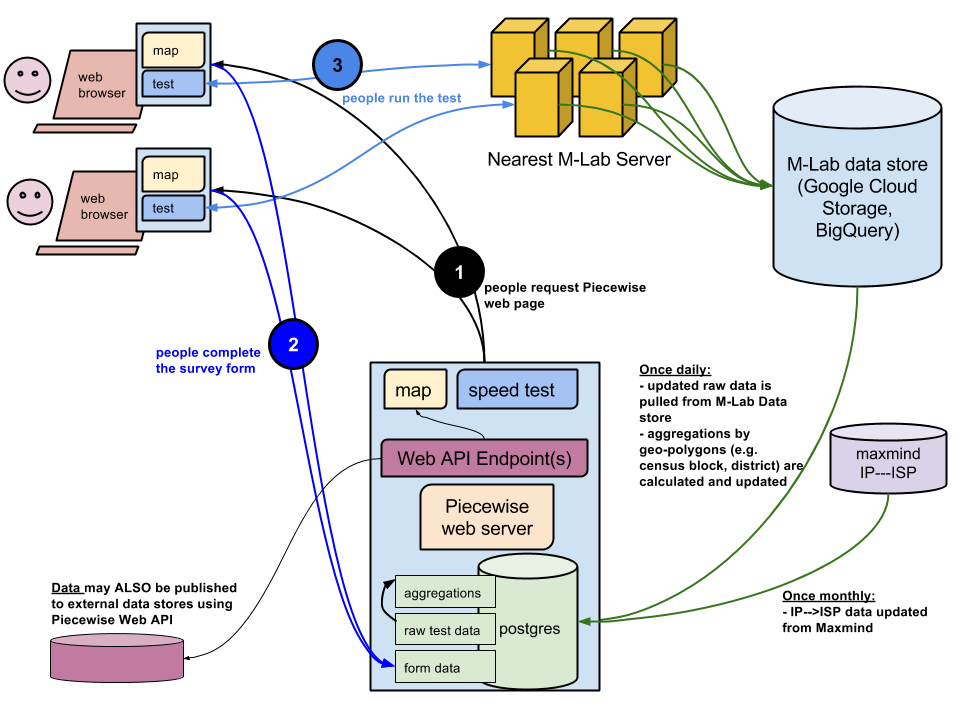

# How Piecewise Works

A basic description of Piecewise is: A Python/Django application that provides a website using data and tools from M-Lab, and runs on your server. 

The data-flow diagram below illustrates the various components of Piecewise, and how it interacts with M-Lab data, how users interact with it, and what services the application itself provides. Following the diagram is a list of the major components and services that a Piecewise server provides or external services with which it interacts.



## Piecewise web server

In the lower center portion of this diagram is the Piecewise web server. The server consists of the Python code that displays the website, and the Network Diagnostic Tool (NDT) speed test from M-Lab, and an endpoint for receiving web form data. A Postgres database is provided to store web form data, M-Lab raw data, and statistical aggregations of the M-Lab raw data. 

A Piecewise server also provides one or more Web API Endpoints, represented in the lower left of the diagram. The Web API Endpoints expose statistical aggregated data that can be used by other applications, or by the Piecewise webserver itself to provide visualizations of the aggregate data. This is how the data for aggregate areas on the default Piecewise map is displayed. 

Learn more about the [statistics provided by Piecewise](piecewise-statistics.md).

## Piecwise interaction with M-Lab

On the right side of this diagram are the M-Lab datastore and the Maxmind IP to ISP database. A Piecewise application ingests M-Lab data from its queryable location in Google BigQuery. See [ingest.py](https://github.com/opentechinstitute/piecewise/blob/master/piecewise/piecewise/ingest.py) for technical information on how this happens. Typically ```ingest.py``` is scheduled to run once daily to bring in new data from M-Lab. Each M-Lab server worldwide sends collected test data in raw, compressed format to Google Cloud Storage on an ongoing basis. M-Lab's raw data is then parsed into BigQuery tables on a daily basis.

The Maxmind IP to ISP database is a freely available and openly licensed IP geolocation source which M-Lab uses to associate ISP names with the tests originating from their networks. Maxmind updates its database once per month, and so Piecewise is typically configured to update on that schedule as well.

## People's interaction with a Piecewise server

The people interacting with a Piecewise server are represented in the top left of the diagram, and in the three labeled steps. 

1. People request the website provided by a Piecewise web server. The map, web form, and speed test are displayed in a web browser. 
2. When a person consents to share their location or completes the web form, that data is stored in the Postgres database on the Piecewise server.
3. When a person runs the NDT speed test, their browser interacts with the closest available M-Lab server to conduct the test. Test data is displayed in the person's web browser, and is submitted to M-Lab's server.